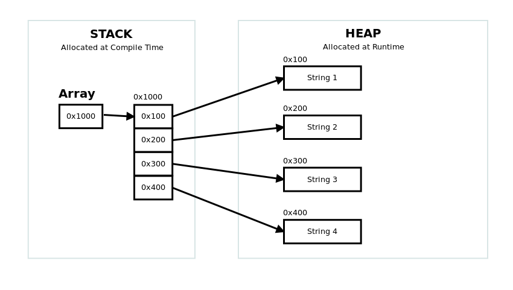
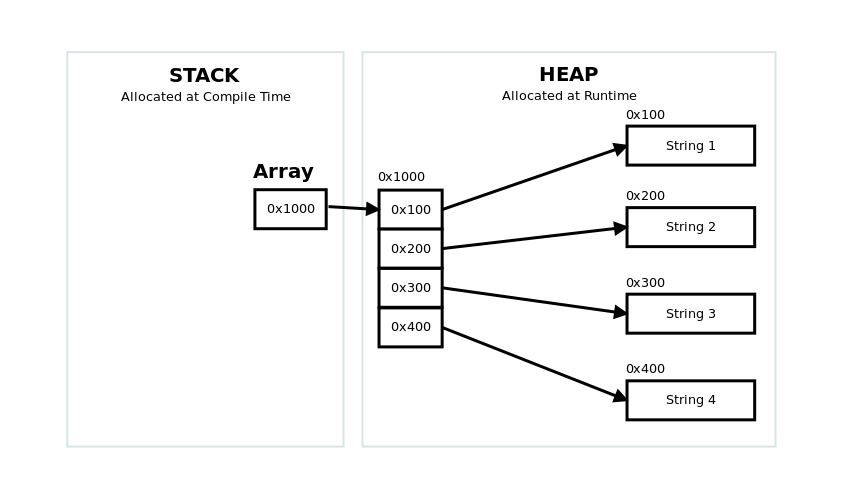

## CSCE 30503: Operating Systems - Week 4 Assignment

### Programming Assignment: Dynamic String Allocation and Pointer Traversal

#### Problem One

In this assignment, you will implement a C filter program that reads an unknown number of strings from Standard Input (stdin), allocate storage for them on the heap, and then display the contents of the array.  Unlike in Java, where all of the memory management decisions have been made for the programmer, programmers have the ability to setup their own memory management in C. In this first program, you will be allocating the **array** on the **Stack** and each of your **strings** on the **Heap**.
```
char *newString(char *str, int size);

void showArray(char **array, int size);
```


Your program will consist of three functions, main, **showArray()** to show the array contents, and **newString()** to allocate a string on the Heap. This program will require you to work with malloc() and free() to ensure your program does not have any memory leaks using Valgrind.  This assignment will also introduce double pointers, which is a pointer to a pointer. You will also see that arrays and pointers are essentially the same thing. (A memory address).

#### Problem Two

Copy your solution from Problem One(**prob1.c**) to **prob2.c**.  In this second program, you will be allocating the **array** on the **Heap** and each of your **strings** on the **Heap**.  You also need to make your array a NULL terminated array. The next location after the last entry in your array shoudl contain **NULL**.  NULL is a 8 byte address of all zeroes.  *It is different than the Null Character ('\0/) ASCII 0 used in Strings.* Modify your showArray() function to accept just the reference to the array, no size parameter.  You will use pointer notation to iterate through the array unto you reach the NULL address.  This will require you to work with double pointers.

```
char *newString(char *str, int size);

void showArray(char **array);
```



**You will need to include the <stdlib.h> Standard Library and you can use the <string.h> String standard libary.**
